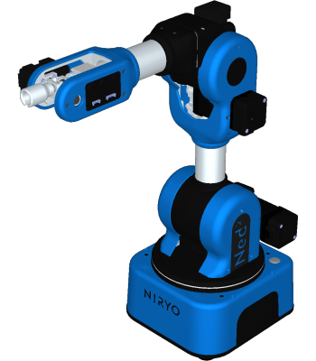
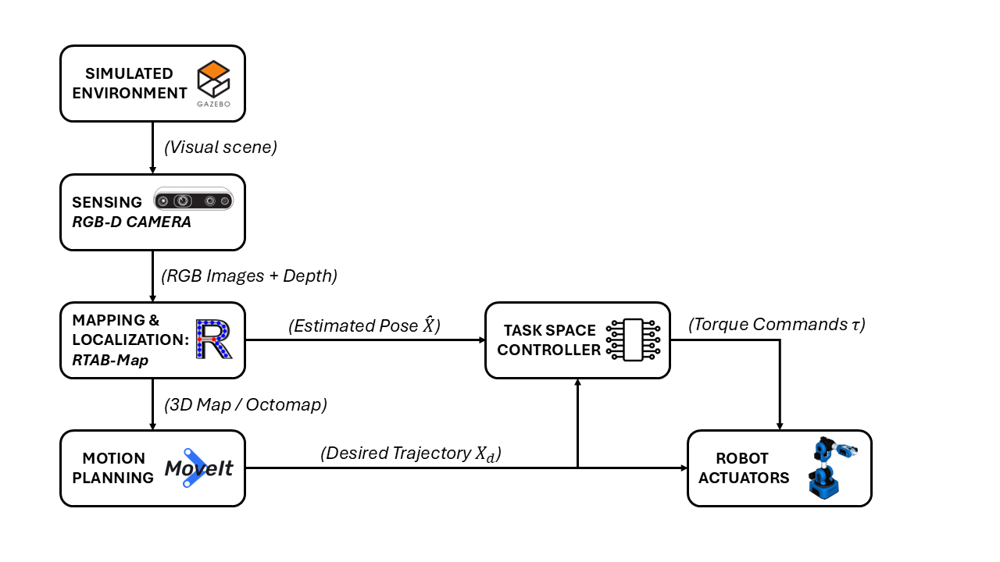
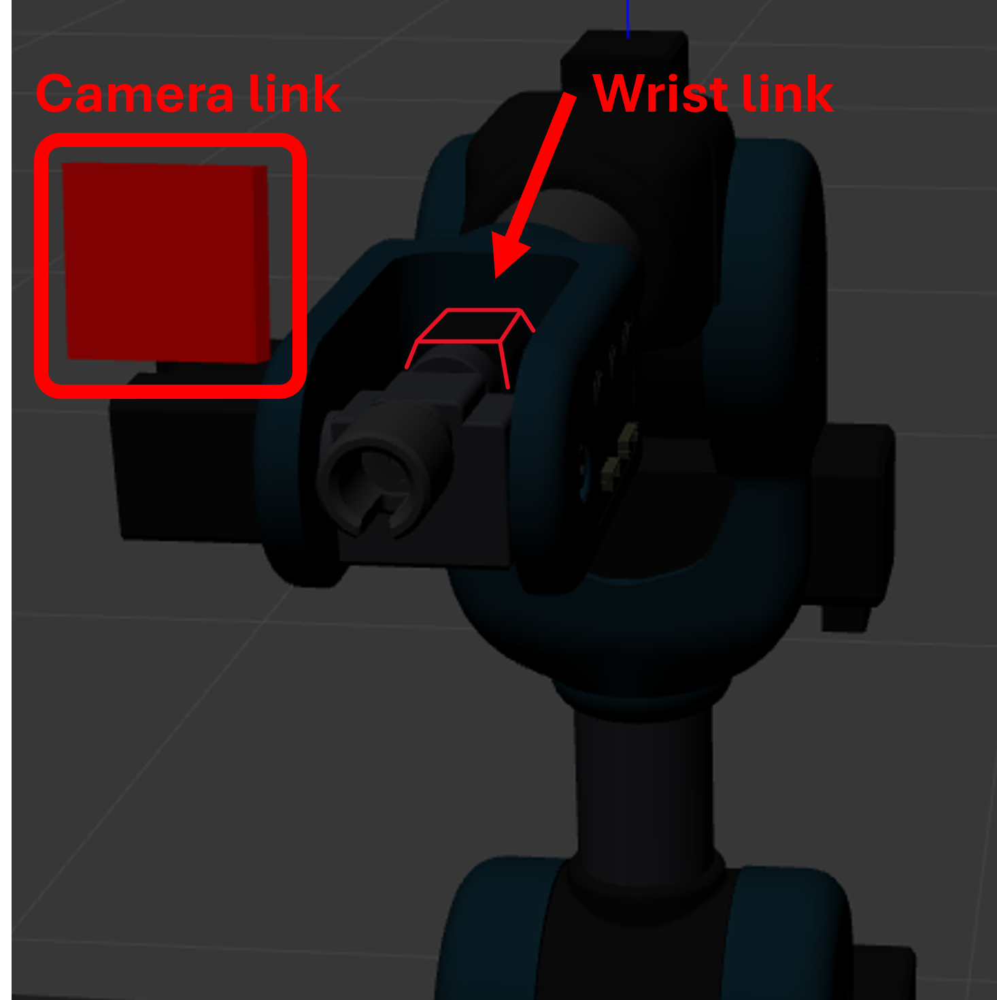
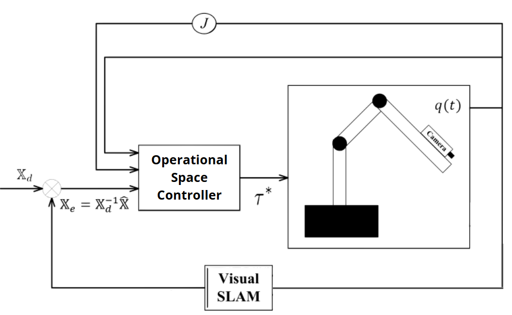
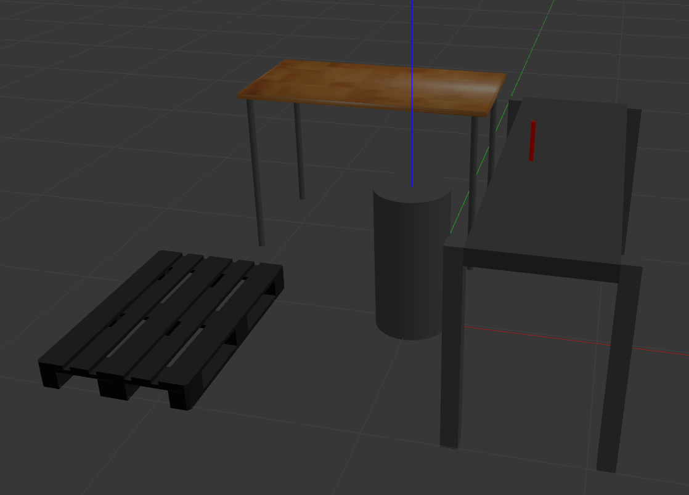
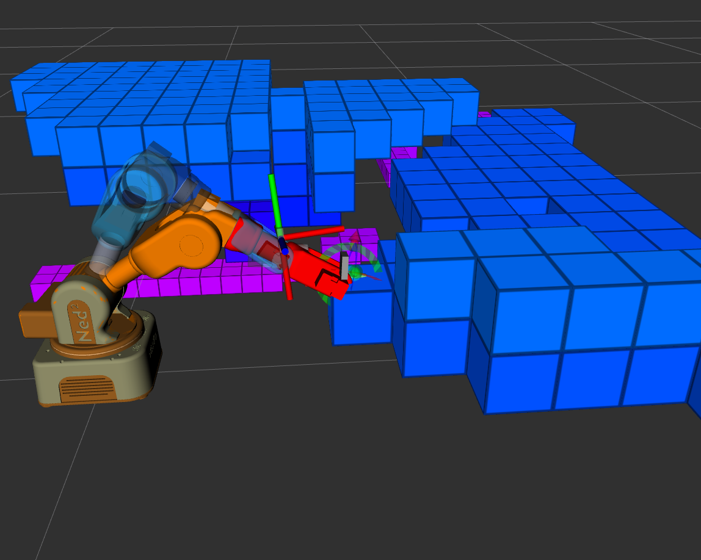
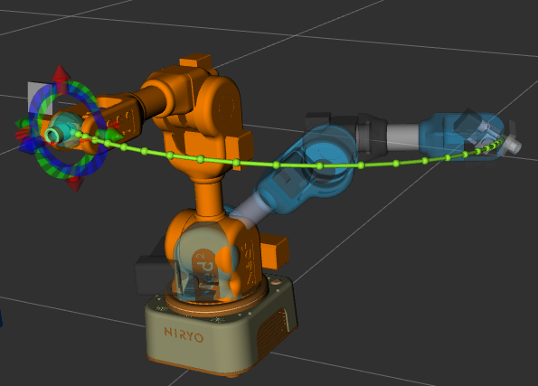
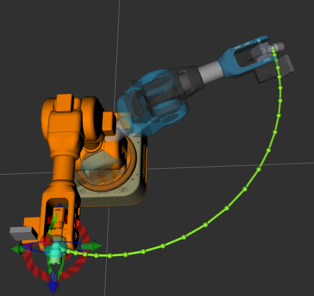
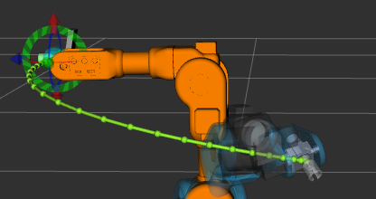
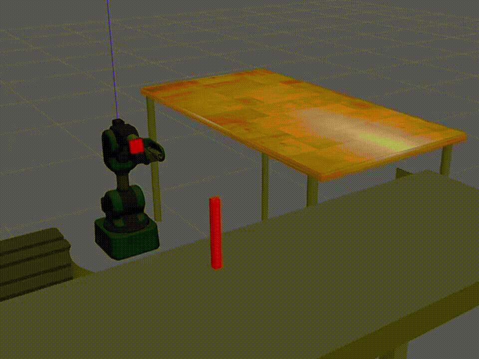

# Operational Space Controller for a Collaborative Robot with SLAM-based Perception
**Master’s Thesis Project — Politecnico di Bari**  
Design and implementation of an **Operational Space Controller (OSC)** for a collaborative robot performing **trajectory tracking in uncertain environments** using **ROS2**, **MoveIt2**, and **RTAB-Map SLAM**.

---

## 🧰 Technologies

**Framework Links:**
- [ROS2 Humble](https://docs.ros.org/en/humble/) — middleware for modular robot control and communication.  
- [MoveIt2](https://moveit.picknik.ai/main/index.html) — motion planning framework integrated with ROS2.  
- [Gazebo](https://gazebosim.org/home) — physics-based simulator for robotic environments.  
- [RTAB-Map](https://introlab.github.io/rtabmap/) — graph-based SLAM for real-time 3D mapping and localization.  
- [Pinocchio](https://stack-of-tasks.github.io/pinocchio/) — library for efficient kinematics and dynamics computations.  
- [MATLAB](https://www.mathworks.com/products/matlab.html) — used for simulation validation and performance analysis.
---

## 🎯 Overview
This project presents the development of a **custom operational-space controller** for a **collaborative robot (Niryo Ned2)** operating in **uncertain and partially unknown environments**.

The controller allows the robot to **follow desired trajectories** while adapting its motion to the dynamically perceived environment through **SLAM-based estimation**.

  

---

## 🧠 System Architecture

The proposed system integrates:
- **ROS2 nodes** for control, trajectory generation, and perception  
- **MoveIt2** for motion planning and collision avoidance  
- **RTAB-Map** for real-time SLAM and 3D mapping  
- **Gazebo** for environment simulation and robot interaction  

  

The **Niryo Ned2 robot** was equipped with a camera rigidly attached to the end-effector for SLAM estimation:

  

---

## ⚙️ Controller Design

The **Operational Space Controller** was developed as a custom ROS2 plugin written in **C++**, integrated into the MoveIt2 control pipeline.

  

Key features:
- Real-time computation of the robot’s **Jacobian and dynamics**
- Task-space feedback control for trajectory tracking  
- Integration with **SLAM-estimated** pose for end-effector correction  
- Communication with **MATLAB** for validation and analysis  

---

## 🧪 Results

The system was tested in **Gazebo simulation** within an unknown environment.  
SLAM-based perception (via RTAB-Map) generated an **OctoMap**, used in MoveIt2 for **collision checking** and path replanning.

  
  

The controller successfully allowed the robot to follow the reference trajectory while adapting to perceived obstacles.

  
  
  

🎥 **Trajectory tracking in simulation (Gazebo):**
> 📝 *The animation below shows the Niryo Ned2 robot following a predefined Cartesian trajectory using the custom operational-space controller. The trajectory is continuously corrected according to the SLAM-based pose estimation of the robot end-effector.*

  

---

## 📊 MATLAB Post-Processing and Validation

A complete **numerical analysis** of the controller performance was performed in MATLAB.  
The scripts, available in the `/results` folder, compute and visualize:
- **Joint torques** and actuator effort over time  
- **SLAM pose estimation error** compared to ground-truth  
- **Tracking error** of the end-effector in Cartesian space  

These analyses validate the controller’s **stability, convergence**, and **robustness to perception noise**.

---

## 👥 Author

Developed by **[Tommaso Savino](https://github.com/ItsTomSav)** 
*Master’s Degree in Automation Engineering, Politecnico di Bari*

---

## 📖 Reference

For a detailed explanation of the methodology, controller derivation, and experimental validation, refer to the full thesis report available in the `/docs` folder.

